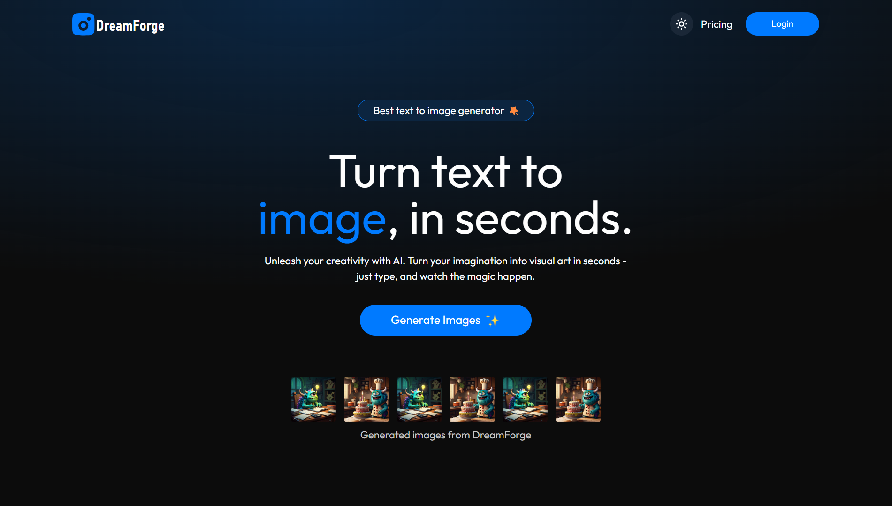
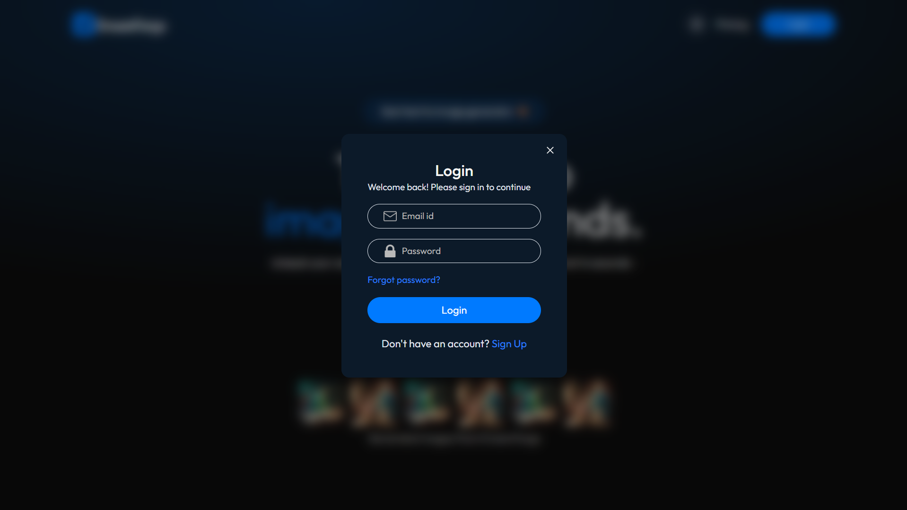
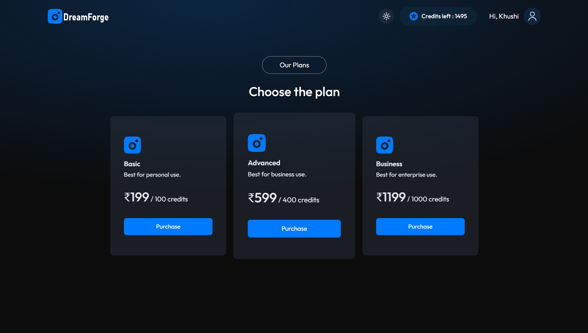
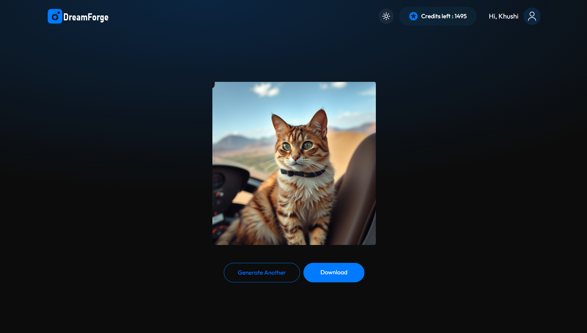

# DreamForge

DreamForge is a modern full-stack MERN application for generating creative AI-powered images and purchasing credits securely via Stripe. It features robust authentication, seamless payments, and a polished, responsive React frontend.

---

## Why DreamForge?

DreamForge is designed to showcase advanced web development skills and best practices. It demonstrates:

- **Full-stack proficiency** (MongoDB, Express, React, Node.js)
- **Secure authentication** and payment flows
- **Integration with third-party APIs** (ClipDrop, Stripe)
- **Modern UI/UX** with animations and responsive design
- **Scalable architecture** and clean code organization

---

## Quick Overview

- **Generate AI images** with custom prompts
- **Purchase credits** using Stripe
- **JWT-based authentication**
- **Mobile-friendly, animated UI**
- **RESTful API with modular backend**
- **Efficient state and API management**

---

## Screenshots

<table>
  <tr>
    <td align="center">
      <br/>
      <em>Home Page</em>
    </td>
    <td align="center">
      <br/>
      <em>Login Page</em>
    </td>
  </tr>
  <tr>
    <td align="center">
      <br/>
      <em>Plans Page</em>
    </td>
    <td align="center">
      <br/>
      <em>Result Page</em>
    </td>
  </tr>
</table>

---

## Live Demo

[View Live Demo](https://dream-forge.onrender.com)

---

## Key Features

- **AI Image Generation:** Powered by ClipDrop API
- **Secure Auth:** JWT, bcrypt, protected routes
- **Stripe Payments:** Real credit purchase flow
- **Credit System:** Spend credits for image generation
- **Notifications:** Toast alerts for feedback
- **Responsive UI:** Built with TailwindCSS & Framer Motion
- **RESTful API:** Modular Express backend
- **Clean Codebase:** Easy to read, extend, and maintain
- **Dark and Light Mode:** User preference support

---

## Installation

**Prerequisites:**

- Node.js & npm
- MongoDB (local/cloud)
- Stripe account & API keys
- ClipDrop API key

**Backend Setup:**

```bash
cd server
npm install
```

Add a `.env` file (see below).

**Frontend Setup:**

```bash
cd client
npm install
```

Add a `.env` file (see below).

---

## Configuration

**Backend (`server/.env`):**

```env
MONGODB_URI=mongodb://localhost:27017/dreamforge
PORT=5000
JWT_SECRET=your_jwt_secret
CLIPDROP_API=your_clipdrop_api_key
STRIPE_SECRET_KEY=your_stripe_secret_key
STRIPE_WEBHOOK_SECRET=your_stripe_webhook_secret
CURRENCY=inr
CLIENT_URL=http://localhost:5173
```

### Example `.env` for Frontend (`client/.env`):

```env
VITE_BACKEND_URL=http://localhost:5000
VITE_STRIPE_PUBLISHABLE_KEY=your_stripe_publishable_key
```

---

## Usage

1. **Start Backend**

```bash
npm start
```

2. **Start Frontend**

```bash
npm run dev
```

3. **Open in Browser:**  
   Visit `http://localhost:5173`
   - Register or log in
   - Purchase credits
   - Generate AI images

---

## API Highlights

**Authentication**

- `POST /api/user/register` — Register new user
- `POST /api/user/login` — Login
- `GET /api/user/credits` — Get user credits

**Image Generation**

- `POST /api/image/generate-image` — Generate image (ClipDrop)

**Payments**

- `POST /api/payment/create-checkout-session` — Stripe checkout
- `POST /api/payment/webhook` — Stripe webhook for credit update

---

## Tech Stack

**Frontend:**  
React, Vite, TailwindCSS, React Router, Framer Motion, Axios, React Toastify

**Backend:**  
Node.js, Express, MongoDB, Mongoose, JWT, Bcrypt, Stripe, Dotenv, CORS

---

## Folder Structure

```
DreamForge/
├── client/
│   ├── src/
│   │   ├── assets/
│   │   ├── components/
│   │   ├── context/
│   │   ├── pages/
│   │   ├── App.jsx
│   │   ├── main.jsx
│   │   └── index.css
│   ├── public/
│   ├── package.json
│   └── ...
├── server/
│   ├── controllers/
│   ├── middlewares/
│   ├── models/
│   ├── routes/
│   ├── config/
│   ├── server.js
│   ├── package.json
│   └── ...
└── README.md
```

---

## Contributing

Contributions are welcome! Please fork the repository and submit a pull request.  
For major changes, open an issue first to discuss your ideas.

---

## Future Improvements

- Add Google/Facebook OAuth.
- Email verification on registration.
- Add user profile management (update name, email, password).
- Implement password reset functionality.
- Add history of generated images for users.
- Improve UI/UX with more animations and better responsiveness.
- Optimize backend performance and error handling.

---

## Acknowledgements / Credits

- [ClipDrop API](https://clipdrop.co/apis)
- [Stripe](https://stripe.com/)
- [React](https://react.dev/)
- [MongoDB](https://www.mongodb.com/)
- [Express](https://expressjs.com/)
- [Motion](https://www.framer.com/motion/)
- [React-Toastify](https://fkhadra.github.io/react-toastify/)
- [React-Router-DOM](https://reactrouter.com/)
- [Axios](https://axios-http.com/)

---

## License

This project is licensed under the [MIT License](./LICENSE).

---

## Badges

[](LICENSE)
[](https://react.dev/)
[](https://nodejs.org/)
[](https://expressjs.com/)
[](https://mongodb.com/)
[](https://react.dev/)
[](https://stripe.com/)
[](https://jwt.io/)
[](https://vitejs.dev/)
[](https://tailwindcss.com/)

---
